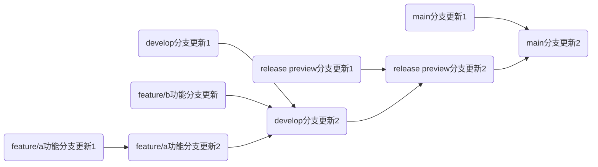

# 怎么贡献？
## commit message

需要遵循以下格式:
```
更新类型(更新模块):(可选)(版本号) (更新概括):

- 更新内容1
- 更新内容2
- ...
```

更新类型有这些内容:
| 类型 | 说明 |
|---|---|
| ✅feat | 新功能 |
| 🐛fix | 修bug  |
| ⚒️refactor |  重构，不新增功能，也不修bug |
| 📃docs | 改文档，比如README |
| ❇️style | 改代码风格，不影响功能 |
| 🔎test | 加测试、改测试 |
| 📆chore | 杂项，比如改.gitignore、构建脚本 |
| ⏫perf | 性能优化  |
| 🛒ci | CI/CD相关改动 |
| 🚅build | 改构建系统或依赖 |
| ◀️revert  | 回滚某个提交 |
| 🔡dependency | 依赖更新 |
| ❌remove | 删除弃用的组件 |
| ↪️move | 移动了组件 |
| ❓unknown | 未知类型 |
| 自定义  | 尽量以一个直观的英文单词描述，最好配上emoji |

内容较多时需要对更新内容添加更新类型提示

## 分支
旧版本的分支只有main，导致版本管理极不方便，虽然后面测试版分到了develop分支，但是更新管理也不明确。

这是新版本的分支管理：


创建的分支必须以feature/开头，以表示功能分支。

## 版本号
版本号格式使用语义化版本号，具体规则如下：
```
A.B.C.D((.dev | alpha | beta | rc)E)
```

- A: 主版本号，当有重大功能更新时，比如重构等。
- B: 次版本号，当有新功能或功能改进时，比如增加新功能。
- C: 修订号，当有bug修复或功能改进时，比如修复bug等。
- D: 开发版本号，每发布一个正式版，D位版本号加1。
- (.dev | alpha | beta | rc): 测试版本阶段，dev表示开发版，alpha表示内部测试版，beta表示公开测试版，rc表示候选版本，E位越大版本越新，且在开发阶段更新时E为变为1，在.dev时候以0开始。版本新旧顺序为.dev < alpha < beta < rc。

## issue
- 标题格式：`[类型] 标题`
- 类型为`bug`、`enhancement`、`question`等。
- 我们给了一些模板，可前往[issue模板](./.github/ISSUE_TEMPLATE/)下的markdown文件查看。
- 使用`labels`来标记issue的类型，比如`bug`、`enhancement`、`question`等。
- 设置issue的`milestone`为你想应用的issue版本。
- 安全问题请见[安全说明文档](./SECURITY.md)。

### milestone
- 我们给每个版本都设置了一个milestone，用来管理该版本的issue和pr。
- 需要每个issue都关联到一个milestone，这样我们才能知道该issue是否已经完成，以及该issue是否在下个版本中进行。
- 格式为:`dev_版本号`

## pr
- 标题格式：`[类型] 标题`
- 使用`labels`来标记pr的类型，比如`bug`、`enhancement`、`question`等。
- 关联issue，这样我们就可以知道这个pr解决了哪个issue。
- 需要准确写出更新内容，关联到版本号的milestone。
- 可选添加实现思路
### 快车pr
- 快车pr的意思是跳过部分正常的pr步骤，更快的合并到目标分支的功能。
- 标题格式：`[快车] 标题`
> [!WARNING]
> 快车pr请谨慎使用