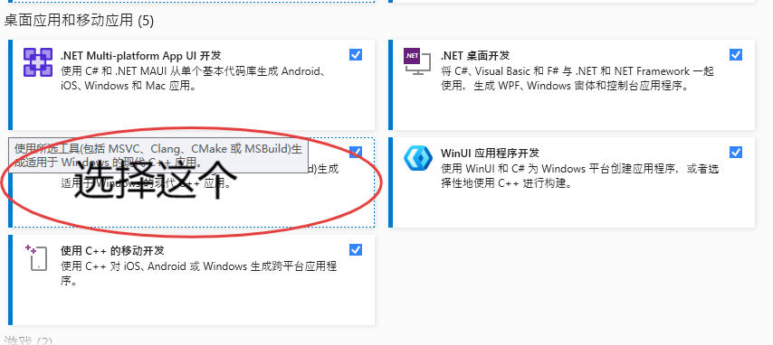
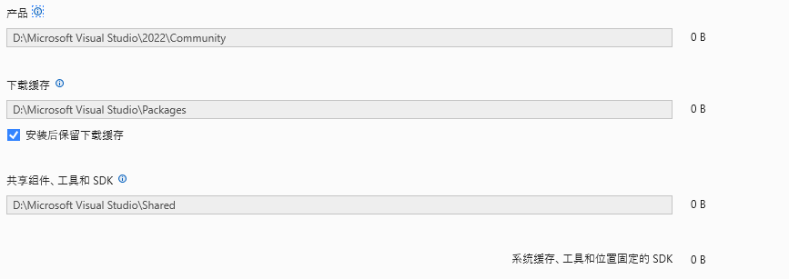
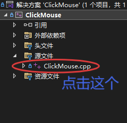
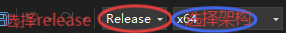
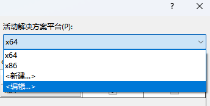

# Clickmouse
>[!IMPORTANT]
> 本库已经停止更新，请转移到[pyClickMouse](https://github.com/xystudio889/pyClickMouse),C++代码写不动QAQ，转为python了

[更新日志](./updates.md)

## 版权声明
<a target="_blank" href="https://icons8.com/icon/13347/mouse">鼠标</a> 的图标 <a target="_blank" href="https://icons8.com">Icons8</a>

## 介绍
一款轻便、快捷，使用C++制作的鼠标连点器，文件大小<1MB。目前项目处于早期阶段，功能还不完善，欢迎大家提出宝贵意见。

## 配置要求
配置要求不大，但是releases中仅编译了x64版本，其他版本需要自行编译。

## 编译方法
1. 下载源码
2. 安装[Visual Studio 2022](https://visualstudio.microsoft.com/zh-hans/vs/)
> [!TIP]
> 需要选择Community版本，其他版本需要许可证。
>
> 安装时需要勾选`使用C++的桌面开发`，如果你有其他盘，需要在`安装位置`里选择其他盘，要不然你的C盘...

3. 打开项目文件`clickMouse.sln`
4. 找到`源文件/clickMouse.cpp`

5. 设置release版本
6. 设置架构(更多架构可以点击架构->配置管理器->活动解决方案平台->新建)
7. 按下`ctrl+shift+B`编译，编译出来的文件通常在`<架构名>/release/clickMouse.exe`

8. 把程序移动到你想要放置的地方

## 安装
无需安装，直接运行即可。

## 功能
- 鼠标连点
- 自定义连点间隔

## 下载
前往releases下载，更新需要替换clickMouse.exe文件。

## 使用方法
鼠标连点，目前支持左键和右键。
下方的输入框输入间隔，再选择想要点击的类型即可开始连点。

鼠标连点器会一直保持运行，直到关闭程序或手动停止。
目前支持暂停和停止功能。
## 内容展望
- [x] 连点功能
- [x] 输入间隔
- [ ] 热键启动
- [ ] 输入次数
- [ ] 自动更新
- [ ] 设置
- [ ] 命令行参数
