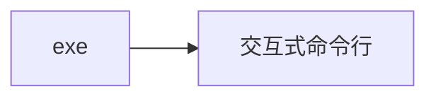
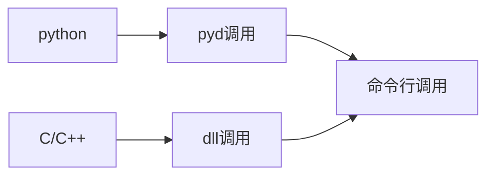

# Clickmouse

<div align = "center">
    <a href="https://pypi.org/project/ClickMouse/">
        
    </a>
    <a href="https://img.shields.io/pypi/pyversions/ClickMouse">
        
    </a>
    <a href="https://github.com/gaogaotiantian/viztracer/blob/master/LICENSE">
        
    </a>
    <a href="https://github.com/xystudio889/pyclickmouse/commits/master">
        
    </a>
    <a href="https://github.com/sponsors/xystudio889">
        
    </a>
    <br />
    <a href="https://github.com/xystudio889/clickmouse/releases">
        
    </a>
</div>

## 版权声明
<a target="_blank" href="https://icons8.com/icon/13347/mouse">鼠标</a> 的图标 <a target="_blank" href="https://icons8.com">Icons8</a>

## 介绍
一款快捷，使用python制作的鼠标连点器。目前项目处于早期阶段，功能还不完善，欢迎大家提出宝贵意见。

这个软件可以有较多的版本，基本都是C/C++调用版本、python调用版本和命令行交互版本。

## 使用的第三方库和使用的功能
### 核心库
#### python
wxpython：对于gui界面，他是图形核心框架
pyautogui：鼠标连点器核心
requests：用于检查版本号
### 打包或编译
nuitka：打包为gui或~~交互式命令行~~的库
~~cython：打包为pyd或dll的库~~暂时不使用，敬请期待
setuptools：打包为python包的库
### 快速安装
输入`pip install -r requirements.txt`安装

## 支持调用的工具
- [x] C/C++头文件调用 使用原本C++版本的clickMouse改装而来 速度最快，兼容性最好，但是使用失效的可能性最大。可以从[releases](https://github.com/xystudio889/pyClickMouse)下载
- [ ] 使用.dll调用 基于C++语言，速度最快，兼容性较好，使用失效的可能性最大。(配置较难，推荐使用C/C++头文件)~~可以从[releases](https://github.com/xystudio889/pyClickMouse)下载~~ 暂时没有该版本，敬请期待
- [x] (开发人员推荐)python调用 速度中等，兼容性最好，使用失效的可能性最小。可以使用`pip install clickmouse`下载
- [ ] 使用.pyd调用 基于python语言，速度较快，兼容性较差（不同版本的python可能不兼容），使用失效的可能性较小。~~可以从[releases](https://github.com/xystudio889/pyClickMouse)下载~~ 暂时没有该版本，敬请期待
- [x] (普通用户推荐)使用exe 使用 基于交互式命令行添加了gui。可以从[releases](https://github.com/xystudio889/pyClickMouse)下载
- [ ] 使用交互式命令行 使用 基于python语言，比gui轻便。~~可以从[releases](https://github.com/xystudio889/pyClickMouse)下载~~ 暂时没有该版本，敬请期待
- [ ] 使用标准命令行 使用 基于python语言。~~将会自带在除了C++版本外的所有发行版~~ 暂时没有该版本，敬请期待


## 安装和调用
Gui版本和~~命令行交互版本~~无需安装，直接运行即可。

C/C++头文件调用可以直接使用以下代码调用(需要配置include目录)
```C++
#include <clickMouse.h>
#include <iostream>
using namespace std;

int main(){
    cout << CLICKMOUSE_VERSION << endl; // 打印版本信息,若成功输出一串数字，则安装成功
    clickMouse(LEFT, 1000, 10, 10); // 连点10次左键，间隔为1000ms，按下时间为10ms，
    return 0;
}
```
python调用或~~.pyd调用~~可以直接使用以下代码调用：
```python
import clickmouse

clickMouse.click_mouse(clickmouse.LEFT, 1000, 10, 10) # 连点10次左键，间隔为1000ms，按下时间为10ms，
```
~~命令行调用~~
```bash
ClickMouse.exe /h # 查看帮助
```


## 功能
- 鼠标连点
- 自定义连点间隔

## 下载
前往releases下载，更新需要替换clickMouse.exe文件。

## 再次编译的注意事项
再次编译时候，需要在key.json文件内添加api key

## 使用方法
鼠标连点，目前支持左键和右键。
下方的输入框输入间隔，再选择想要点击的类型即可开始连点。

### 使用优先级
普通用户：

开发人员：

鼠标连点器会一直保持运行，直到关闭程序或手动停止。
目前支持暂停和停止功能。
## 内容展望
- [x] 连点功能
- [x] 输入间隔
- [ ] 热键启动
- [ ] 输入次数
- [ ] 自动更新
- [ ] 设置
- [ ] 命令行参数
