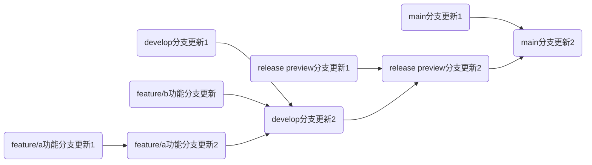

## commit message

需要遵循以下格式:
```
更新类型(更新模块):(可选)(版本号) (更新概括):

- 更新内容1
- 更新内容2
...
```

更新类型有这些内容:
| 类型 | 说明 |
|---|---|
| feat | 新功能 |
| fix | 修bug  |
| refactor |  重构，不新增功能，也不修bug |
| docs | 改文档，比如README |
| style | 改代码风格，不影响功能 |
| test | 加测试、改测试 |
| chore | 杂项，比如改.gitignore、构建脚本，或更新内容较多是可以用（需要对更新内容添加更新类型提示） |
| perf | 性能优化  |
| ci | CI/CD相关改动 |
| build | 改构建系统或依赖 |
| revert  | 回滚某个提交 |

## 分支
旧版本的分支只有main，导致版本管理极不方便，虽然后面测试版分到了develop分支，但是更新管理也不明确。

这是新版本的分支管理：

